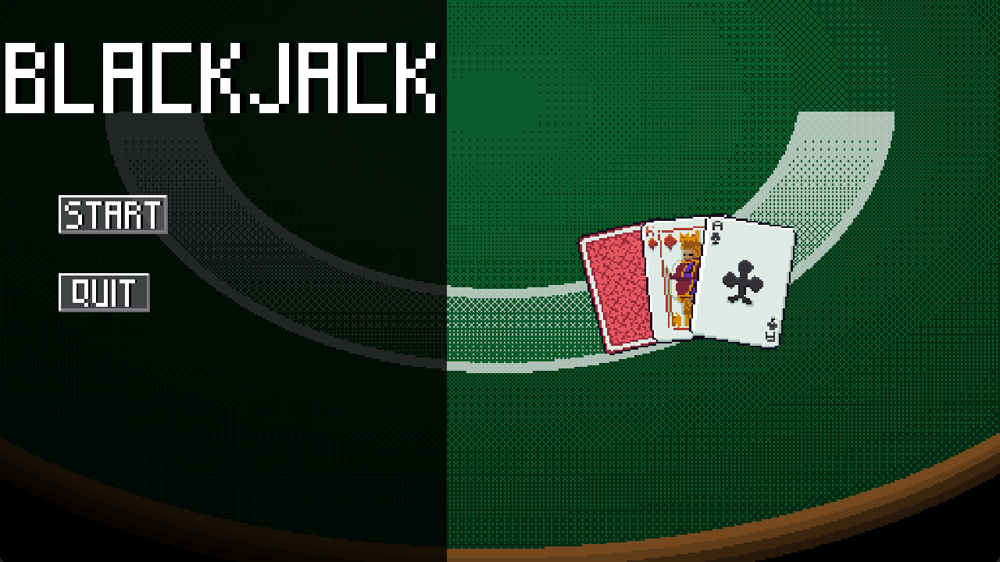

# Blackjack

# Controls
Controls are implemented with mouse

On game start player needs to make a bet:

Button with chips adds bet count

Button "Bet" confirms bet and dealer start to hand out cards

Button "Hit" and "Stand" cannot be pressed before bet confirmation

# Changing skin
Game has option to change skin for cards in real time

To access it player must open pause menu (which is accessible in the top left corner) and press buttons in the bottom of screen. Skins are loaded in real time, so player can change them even being booted to the game

# Skin Examples

# Game over
After losing all cash and bets player faces game over screen

# Credits for resources:
Sounds from [Texas Hold’em](https://apps.apple.com/us/app/texas-holdem/id284602850) and [Half-life 2](https://store.steampowered.com/app/220/HalfLife_2/)

Cards by [IvoryRed](https://ivoryred.itch.io): [Link](https://ivoryred.itch.io/pixel-poker-cards)